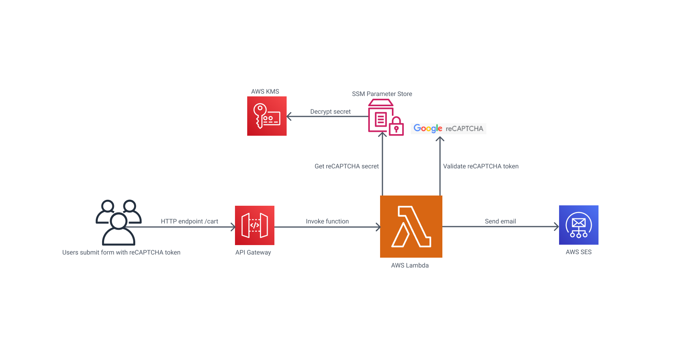

# Dom server

Serverless and scalable backend designed to securely send emails with customers information.

## Services used

- [AWS API Gateway](https://aws.amazon.com/api-gateway/) - Fully managed APIs
- [AWS Lambda](https://aws.amazon.com/lambda/) - Serverless, event driven compute service
- [AWS SES](https://aws.amazon.com/ses/) - Scalable email service
- [AWS SSM Parameter Store](https://docs.aws.amazon.com/systems-manager/) - Secure, hierarchical storage
- [AWS KMS](https://aws.amazon.com/kms/) - Cryptographic keys creation and management
- [Google reCAPTCHA v3](https://www.google.com/recaptcha/about/) - Bot protection

## Architecture overview



## Built with

- [Node.js](https://nodejs.org/en/) - JavaScript runtime
- [TypeScript](https://www.typescriptlang.org/) - Typed JavaScript
- [AWS SDK v3](https://docs.aws.amazon.com/AWSJavaScriptSDK/v3/latest/) - Version 3 of AWS SDK for JavaScript
- [AWS SAM](https://docs.aws.amazon.com/serverless-application-model/) - Open-source framework to build serverless applications on AWS

## Run local API for development

```
$ npm run serve
```

## Run unit tests

```
$ npm test
```

## Build for production

```
$ npm run build
```

## Deploy to AWS

```
$ npm run deploy
```
